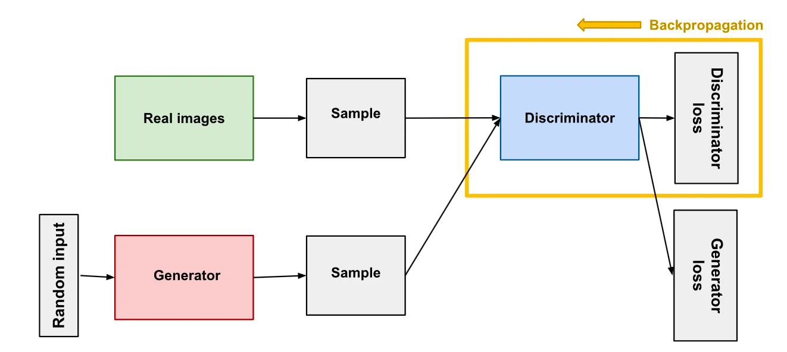

# Restricting Generative-AI Music
# Zach Olsen
# December 2023

### Introduction
	
Over the past couple of years, artificial intelligence has taken over the world of technology. With new and improving machines, we are able to do things with artificial intelligence that 20 years ago, we could never imagine we would be able to do. With the advancements in the artificial intelligence field, we can now generate music simply using AI on sites like Boomy, Loudly, Soundraw, etc. Music in AI has been a very controversial topic in its short span of existence. While AI models seem like the future, there have been a lot of ethical dilemmas tied to the field, and understanding where to draw the line. There are constant discussions of whether or not generative music should be classified as “music” because it is not created by a human. Another huge topic of discussion on the ethics of AI music is copyright issues, going both ways: using another artist as an input to the machine, and the user copyrighting “his”/”her” music. 

### Thesis
	
To protect the use of AI-generated music, boundaries must be set on them because the credits for the generated sound are unclear, and the tools generating the music should not be used for profit.

### Background
	
A lot of music-generative AI models that are available to the public, like Boomy, allows the user to input some text to generate a song. Simply, AI-generated music is created “using software to analyze existing music and then generate new compositions based on that analysis. The process usually involves feeding a large dataset of music into an AI algorithm, which then analyzes the patterns and structures of that music to create its own original compositions”1.  This article goes on to explain that the music that is generated is not random notes or sounds, but instead is a complex arrangement of musical elements that takes into account important factors in music: melody, harmony, rhythm, tempo, and tone. To truly understand how these AI models generate music that sounds complete, it is important to understand the structure of the model. To generate music, the model used is a generative adversarial network (GAN), which generates new data according to your training data, which in terms of AI-generated music, is all the songs that the operator uses as an input. This model helps display the architecture of a GAN2:

In this image, this is the framework of a GAN for image-generation (the GAN for music would be exactly the same, except the inputs would be songs, or sounds, rather than images in this image). The model puts a random vector as an input (which is just noise) through the generator, which outputs a counterfeit audio sample. This counterfeit sample and the real songs/sounds both get sent through the discriminator, which compares the fake samples with the real and classifies them as either fake or real. The discriminator loss penalizes incorrect results (guessed fake/real and it was wrong), which learns to better identify the counterfeits from real images. The generator loss increases when the output is fake, and is classified as fake, so as to improve the quality of counterfeits. The goal is to minimize the sum of the discriminator and generator loss over time. Chris Tralie describes the reasoning for the two losses very well in one of his assignments for his Artificial Intelligence class at Ursinus: “The learning proceeds by taking steps to minimize the loss over steps 1 and 2 over and over again in a loop. What’s interesting is that as the generator improves, the loss of the discriminator goes up, and it must improve, and vice versa”3. While in his example, the class was using images, the idea is still the same for music samples.
	All in all, the GAN model is trained through this process in order to output samples that sound extremely real. So, AI-generated music sites (like Boomy) gather the user’s text input as data, and classify their real data based on your input. For example, if you were to input something along the lines of “Drake song”, it would only use Drake’s music as the input to train the model on, so the output would sound like a Drake song. In fact, these sites have a different model for vocals, drums, synthesizers, and any other instruments or sound effects to create an even better-sounding song. This allows the user to input “Make Taylor Swift Bohemian Rhapsody”, and use Taylor Swift’s vocals, with the Bohemian Rhapsody instrumental, for example. 

### Body

Restrictions on AI-generated music need to be set because of the amount of “legal gray-area” involved with the ownership of this “music”. When listening to an AI-generated song, the name of the artist of the song is listed as well. This may seem like a small detail of the song, but it is actually a growing problem of generative-AI: who gets the credit? The rights of the generated music have been fought since its existence between the creators of the AI tool, and the user who inputted the text to generate the music. In an article discussing the issues of copyright with AI-generated music, Don McCombie explains that even if the songs were to be copyright-free, and totally legal, the owner of the output is still unclear, stating: “Although the only judgment on s. 9(3) CDPA to date held that image frames generated in the course of playing a video game belonged to game’s publisher rather than the game’s player”4. Although the courts ruled in favor of the tool creators, McCombie elaborates that the use of an AI tool is fundamentally different from the images a player creates in a video game. 

One interesting viewpoint comes from the academic paper AI Music Outputs: Challenges to the Copyright Legal Framework, where the author discusses the legal aspect of the outputs from generative-AI. The article uses EU laws rather than US, the copyright laws between the two countries are very similar. The authors discuss assessments of copyright protection, specifically about the “work” being human-free and that there is independent creativity in the output. In the article, they state, “...the Court states in the negative that ‘the components of a graphic user interface do not permit the author to express his creativity in an original manner and achieve a result which is an intellectual creation of that author’”5. Strictly coming from a legal standpoint, the ownership of the generated music should be the creators of the AI tool due to the impossibility of creating original outputs using a computer. Although the user inputted text to create an output based on the AI model, the user’s text is also unique, which highlights the problem with who deserves the credit. The confusion of who deserves credit can easily be eliminated with restrictions on these tools.

While there is an issue with who to credit between the creators of the AI tools and the users who created a song using the tool, there is another person to consider for credit. The AI tool uses real songs by real artists to train their models. The artists of these songs have also looked to get credit for these songs. In her paper Ethical Risk Analysis of the Use of AI in Music Production, Alexandra Reje discusses this issue and says, “...it becomes a problem of determining the influence the original song had on the training, the similarity of the results and how to identify all relevant copyright holders”6. This statement raises many problems as to how to actually calculate the influence and similarity of the results. Another issue with influence is that influence is inevitable. Musician/songwriter Dr. Martin Clancy states, “A musical composition is always and inevitably influenced by other compositions, and it is an accepted and established practice for composers to reference or repurpose motifs, riffs, grooves or other characteristic ideas in an often-undisguised salute to an author’s creative kinship”7. Since influence is inevitable, does it give artists the right to want credit for influencing an AI song, but not want credit when other artists reference their songs?

The credit of the song is important in determining who profits from the generated music. This has sparked a lot of controversy with popular artists calling out AI-generated music using their songs/vocals to train their models, without the consent of the artist, or any payment/royalties given to the artist, or band. This brought one EDM artist Grimes to address the issue on Twitter saying, “I’ll split 50 [percent] royalties on any successful AI generated song that uses my voice… Same deal as I would with any artist i collab with”. However, RollinStone writer Althea Legaspi states that “While Grimes is advocating for AI’s use, the music industry has been grappling with the role of AI in song creation, and its legal and financial ramifications”8. Grimes is encouraging the use of her voice to generate music, in exchange for 50% of the royalties; a huge issue with the finances of AI-generated music. 

Earlier this year, there was a viral AI-generated song by TikTok user Ghostwriter977 called “Heart on My Sleeve” that “featured” Drake, The Weeknd, and hip-hop producer Metro Boomin. The song was uploaded to Spotify and Apple Music on April 4 after its huge success on TikTok. Universal Music Group (UMG) have deals with Drake and The Weeknd, and requested that the song be removed from streaming platforms. UMG released a statement to Rolling Stone bashing generative AI, saying it is “denying artists their due compensation”8. Without proper financial compensation, it is not fair to the artists whose music is being used to train the AI models. According to an article in Harvard Law Today discussing the song, Rachel Reed informs the reader that the song got taken down from different social media platforms after the attorneys representing UMG used a DMCA (Digital Millennium Copyright Act), which is “a process… which allows a rights-holder to give notice to a third party like YouTube or Apple Music that a work they are distributing is, in the rights-holder’s view, violating their copyright acts. And then, to protect certain rights that those platforms have under the DMCA, the platforms have to immediately take it down”9. Reed goes on to say that “it actually wasn’t taken down on the basis of it being a copy of Drake and The Weeknd’s style, but in fact, was taken down because of the express copying of a ‘producer tag’ in the song by a producer called Metro Boomin”9. While Metro Boomin’s vocals were not used in the generative-AI, his producer tag was. A producer tag is a way for a producer to let the listener know that he/she produced the song, and is a staple in the hip-hop community, popularized by Pharrell Williams with his 4-beat producer tag (if curious: https://www.youtube.com/watch?v=ixXNeUFdl3I). It is interesting that the reasoning behind the song getting taken down was due to the producer tag, rather than Drake or The Weeknd’s voice/timbre. 

Discussing the originality of the output of generative-AI, the United States government, more specifically the Copyright Office had to take action and address the growing dilemma. There were concerns about the ability to copyright generative-AI, specifically music. To be able to copyright a piece of work, “under the U.S. Copyright Act, works may be registered for copyright protection if they are ‘original works of authorship fixed in any tangible medium of expression’”10. The wording of this law provided a gray-area for generative-AI due to people questioning its originality and authorship, since the song was generated using other songs (declassifying originality), and the author is unclear (declassifying authorship). This led the Copyright Office to release a policy statement on March 16, 2023: “When an AI technology determines the expressive elements of its output, the generated material is not the product of human authorship. As a result, that material is not protected by copyright and must be disclaimed in a registration application”10. This is a great step in the right direction to restricting generative-AI by denying the ability to copyright an output from an AI tool. 

### Conclusion: My Stance
	
While certain restrictions on the copyright of generative-AI have been set, there is still a long way to go. There needs to be more restrictions on its use, as it should only be used as a tool. This is the purpose of generative-AI, and how it should be used, rather than being used for profits. All of the copyright and legal issues involved make it very hard to use these tools for their intended purpose. It is also extremely unclear as to who gets ownership of the output, with people having constant arguments about the issue. I believe it is just easier to restrict generative-AI by making the use of it by the public to be free, as well as generating audio watermarks, or image watermarks so that the output cannot be used to profit. Just like with many new innovations, money is a huge issue with generative-AI. We should be using generative-AI as a tool, and as a source, but greedy people use it to make money for themselves. This is where the line needs to be drawn.

### Sources:

AI-generated music: a new form of art by ALContentfy team:	https://aicontentfy.com/en/blog/ai-generated-music-new-form-of-art#:~:text=Essentially%2C%20it%20involves%20using%20computer,create%20its%20own%20original%20compositions.

The Math Behind Generative AI for Software Engineers (1 must-know formula) by Randy Ip:	https://medium.com/@randyip9/the-math-behind-generative-ai-for-software-engineers-1-must-know-formula-d2a5db9269a8

Homework 7 Part 1: This Cat Doesn’t Exist by Chris Tralie: https://ursinus-cs477-f2023.github.io/CoursePage/Assignments/HW7_GANUNet/part1.html

AI-Generated Music and Copyright by Clifford Chance by Don McCombie: https://www.cliffordchance.com/insights/resources/blogs/talking-tech/en/articles/2023/04/ai-generated-music-and-copyright.html

AI Music Outputs: Challenges to the Copyright Legal Framework by Oleksandr Bulayenko, João Pedro Quintais, Daniel Gervais, Joost Poort: https://deliverypdf.ssrn.com/delivery.php?ID=450091020087110092091065070111101112059038009000020002096085020066103092094004114027119013052038049022008090070112118012119023024091008040092093002120121024101071072086019086120008094119098088084081092086002097018004008083110110026120083095031100094126&EXT=pdf&INDEX=TRUE

Ethical Risk Analysis of the use of AI in Music Production by Alexandra Reje: https://www.diva-portal.org/smash/get/diva2:1711711/FULLTEXT01.pdf

Reflections on the Financial Aid Ethical Implications of Music Generated by Artificial Intelligence by Martin Clancy: http://www.tara.tcd.ie/bitstream/handle/2262/94880/REFLECTIONS%20ON%20THE%20FINANCIAL%20AND%20ETHICAL%20IMPLICATIONS%20OF%20MUSIC%20GENERATED%20BY%20ARTIFICIAL%20INTELLIGENCE.pdf

Grimes on AI Songs: ‘Feel Free to Use My Voice Without Penalty’ by Althea Legaspi: https://www.rollingstone.com/music/music-news/grimes-voice-ai-generated-songs-1234722289/

AI created a song mimicking the work of Drake and The Weeknd, What does that mean for copyright law? by Rachel Reed: https://hls.harvard.edu/today/ai-created-a-song-mimicking-the-work-of-drake-and-the-weeknd-what-does-that-mean-for-copyright-law/

Melodies And Machines: Copyright Challenges With AI Music by Thuan Tran: https://www.jdsupra.com/legalnews/melodies-and-machines-copyright-1294672/
